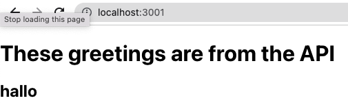

# hello-react-front_end

This is a rails app API, that render random greetings to an react app using API endpoint, it has a table greetings inside a postgresql database.

## Front End
This project works with a react front end site, you can go to the following repo and follow the instructions.
- https://github.com/JasemDuncan/hello-rails-back-end

## Built With

- HTML&CSS
- Javascript
- Rails
- Ruby

## Getting Started
To get a local copy up and running follow these simple steps.

### Setup
 

### Install
- Open your console and change the current working directory into the destination for this project.
- Type `git@github.com:JasemDuncan/hello-rails-back-end.git`
- Type Enter to finish the installation process.
- Run command in terminal: bundle install
- Run command in terminal: rails db:setup
- Run command in terminal: rails db:seed
- Run command in terminal: rails s -p 3000
- Go to: `http://localhost:3000/api/v1/greetings` to see if information is retrieving from DB.

## Authors

👤 **Jasem Duncan Valencia**

- GitHub: [@JasemDuncan](https://github.com/JasemDuncan)
- Twitter: [@JasemDuncan](https://twitter.com/JasemDuncan)
- LinkedIn: [@JasemDuncan](https://www.linkedin.com/in/jasem-duncan-valencia/)
## 🤝 Contributing

Contributions, issues, and feature requests are welcome!

Feel
## Show your support

Give a ⭐️ if you like this project!
## Acknowledgments

- Microverse for the guidelines used for this project
- My SO and project manager, Mane
## 📝 License

This project is [MIT](./LICENSE.md) licensed.
